# gl1

Portable **Zig + Sokol** graphics prototype with a custom **immediate-mode UI**. Built as a greenfield stack for tools,
editors, and eventually TUI backends—with little/no dependencies.

## Requirements

- Zig **master** via [`zvm`](https://github.com/tristanisham/zvm)  
  (tested: `0.17.0-dev.1252+e4b325c19`)
- [sokol-zig](https://github.com/floooh/sokol-zig) (`sokol_app` + `sokol_gfx` + `sokol_gl`)
- Linux with OpenGL + X11 (cross-compile: `zig build windows`; macOS build on a Mac host)

## Build & Run

```bash
zvm use master
zig build
./zig-out/bin/gl1
# optional:
./zig-out/bin/gl1 --scene canvas
./zig-out/bin/gl1 --story-tab Button --auto-quit 2
```

| Flag | Purpose |
|------|---------|
| `--scene <name>` | `storybook` (default), `canvas`, `panels`, `text`, `triangle` |
| `--story-tab <name>` | Open storybook on that sidebar tab (e.g. `ColorPicker`) |
| `--auto-quit <seconds>` | Quit after N seconds (screenshot automation) |

Cross-compile:

```bash
zig build windows        # → zig-out/windows/gl1-windows.exe
zig build macos-arm64    # requires macOS SDK / frameworks
zig build macos-x64
```

---

## Scenes overview

| Scene | CLI | Description |
|-------|-----|-------------|
| [`storybook`](#storybook) | `--scene storybook` | Living widget gallery (**default**) |
| [`canvas`](#canvas) | `--scene canvas` | 3D orbit viewport + editor chrome (tree / inspector / console) |
| [`panels`](#panels) | `--scene panels` | Desktop windows + dock (drag / resize / toggle) |
| [`text`](#text) | `--scene text` | Bitmap font sample |
| [`triangle`](#triangle) | `--scene triangle` | Hello triangle + mouse readout |

---

## Scene gallery

### canvas

Mini Blender-like **3D** viewport: orbit camera, solid cubes as ECS-style
entities, selection outlines, orientation compass, fly mode, plus floating
**scene tree**, **inspector**, and **console** panels.

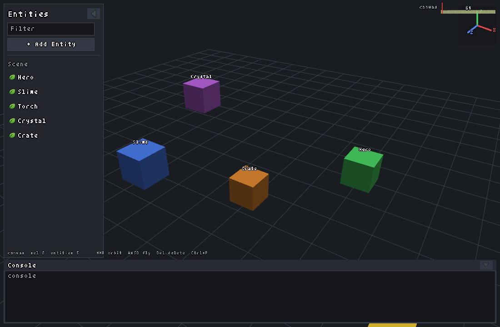

| Input | Action |
|-------|--------|
| **MMB drag** | Orbit (yaw / pitch only; no snap on click) |
| **Shift+MMB drag** | Strafe (pan in camera plane) |
| **Space+LMB drag** | Pan look-target |
| **Wheel** | Dolly (distance) |
| **WASD** | Fly forward / left / back / right |
| **Q** / **E** | Fly down / up |
| **Space** | Fly up (when not Space+LMB panning) |
| **Shift** | Faster fly |
| **LMB** | Select entity (mesh only) |
| **Ctrl/Shift+LMB** | Multi-select toggle |
| **Ctrl+A** | Toggle select all / none |
| **F** or **Numpad `.`** | Frame selection (center + zoom ~80%, 250 ms tween) |
| **1** / **3** / **7** | Front / Right / Top view (numpad or top-row) |
| Top-right RGB gizmo | World-axis orientation (shifts left of expanded inspector) |
| **Del** | Delete selection (when not typing in a field) |

---

### storybook

Widget gallery with a sidebar index. Default launch scene.

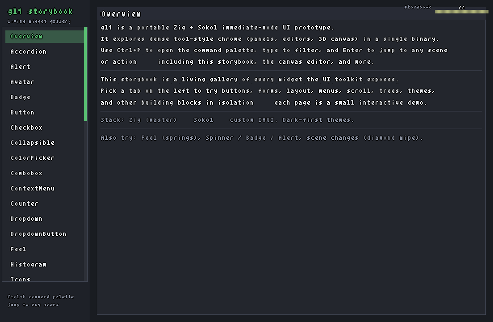

| Input | Action |
|-------|--------|
| Click sidebar row | Open that widget’s playground; focuses nav |
| **↑ / ↓** (nav focused) | Move tab selection (scroll follows) |
| Scroll sidebar / detail | Wheel when hovered (scissor-clipped) |
| **Ctrl+P** | Command palette |

---

### text

Bitmap font atlas demo (magenta chroma key → transparency).

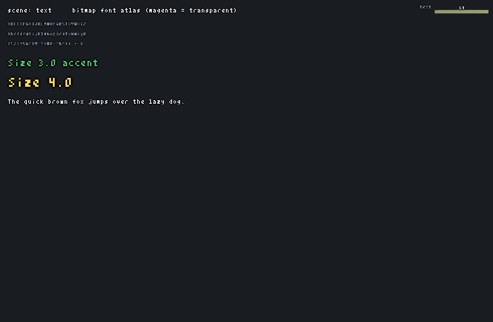

| Input | Action |
|-------|--------|
| — | View only |

---

### triangle

Minimal Sokol GL triangle and mouse position HUD.

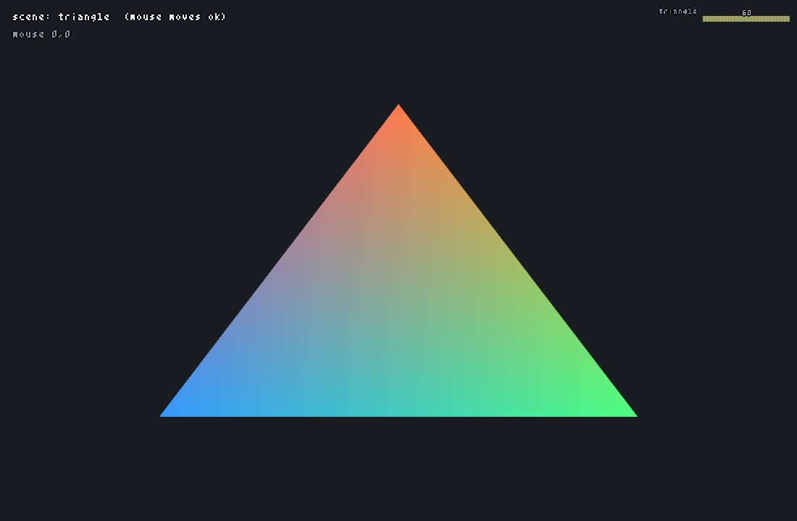

| Input | Action |
|-------|--------|
| Move mouse | Updates on-screen position readout |

---

### panels

Lightweight **desktop**: floating windows, title-bar drag, bottom-right resize
triangle, and a macOS-style dock that opens/closes windows while **remembering
position and size**.

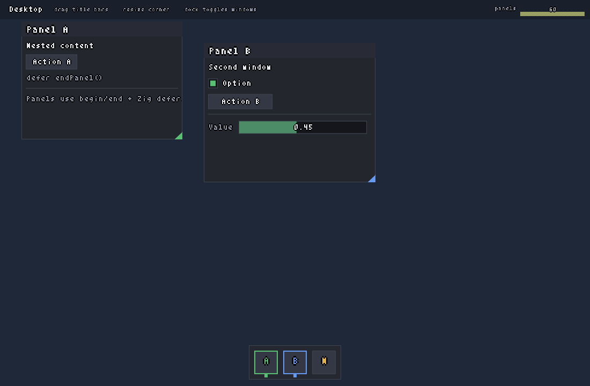

| Input | Action |
|-------|--------|
| Drag window title bar | Move window |
| Drag bottom-right triangle | Resize window |
| Click dock icon | Toggle window open/closed (geometry preserved) |
| Wheel over window body | Scroll clipped content |

---

## UI components

Public widgets live under [`src/ui/components/`](src/ui/components/) and are wrapped by [`src/ui/ui.zig`](src/ui/ui.zig).
Screenshots are the storybook tab for that control (full window: sidebar + detail).

### Catalog

| Name | Purpose |
|------|---------|
| [accordion](src/ui/components/accordion.zig) | Exclusive multi-section expand/collapse |
| [alert](src/ui/components/alert.zig) | Inline status banner (info / ok / warn / err) |
| [avatar](src/ui/components/avatar.zig) | Initials plate + user chip |
| [badge](src/ui/components/badge.zig) | Compact colored status chip |
| [button](src/ui/components/button.zig) | Clickable button (optional primary accent) |
| [checkbox](src/ui/components/checkbox.zig) | Boolean checkbox with label |
| [colorPicker](src/ui/components/colorPicker.zig) | Sinebow scrub + click-to-edit hex |
| [colorSwatch](src/ui/components/colorSwatch.zig) | Selectable solid color square |
| [counter](src/ui/components/counter.zig) | Metric chip (number + caption) |
| [dropdown](src/ui/components/dropdown.zig) | Single-select dropdown menu |
| [dropdownButton](src/ui/components/dropdownButton.zig) | Split primary action + chevron menu |
| [histogram](src/ui/components/histogram.zig) | Scrolling bar strip (frame-time HUD) |
| [imageWell](src/ui/components/imageWell.zig) | Image tile with fit / stretch / fill |
| [keyValueEditor](src/ui/components/keyValueEditor.zig) | Editable key–value pair list |
| [label](src/ui/components/label.zig) | Static text line |
| [link](src/ui/components/link.zig) | Underlined link (opens system browser) |
| [listBox](src/ui/components/listBox.zig) | Scrollable selectable list |
| [listBoxNav](src/ui/components/listBoxNav.zig) | ListBox + keyboard ↑/↓ |
| [multiSelect](src/ui/components/multiSelect.zig) | Multi-select dropdown with checkboxes |
| [passwordInput](src/ui/components/passwordInput.zig) | Masked secret field + eye toggle |
| [progress](src/ui/components/progress.zig) | Determinate progress bar |
| [radio](src/ui/components/radio.zig) | Exclusive radio in a group |
| [requestButton](src/ui/components/requestButton.zig) | Async button: idle → loading → ok / err |
| [searchField](src/ui/components/searchField.zig) | Single-line search with placeholder |
| [segmented](src/ui/components/segmented.zig) | Exclusive button group / segmented control |
| [separator](src/ui/components/separator.zig) | Horizontal rule in a stack |
| [slider](src/ui/components/slider.zig) | Blender-style number slider |
| [spacer](src/ui/components/spacer.zig) | Vertical empty space |
| [spinner](src/ui/components/spinner.zig) | Indeterminate activity spinner |
| [statusPill](src/ui/components/statusPill.zig) | Enum status → colored badge |
| [table](src/ui/components/table.zig) | Data table with row select + sort headers |
| [tabs](src/ui/components/tabs.zig) | Horizontal tab strip |
| [tagInput](src/ui/components/tagInput.zig) | Chip tags + free-type entry |
| [textArea](src/ui/components/textArea.zig) | Multi-line editor (soft wrap, optional line numbers) |
| [textFieldCore](src/ui/components/textFieldCore.zig) | Shared caret/selection engine for fields |
| [textInput](src/ui/components/textInput.zig) | Single-line labeled text field |
| [toggle](src/ui/components/toggle.zig) | On/off switch |
| [typeahead](src/ui/components/typeahead.zig) | Filter-as-you-type + combobox |

Also in [`ui.zig`](src/ui/ui.zig) (not separate component files): **iconButton**, **treeNode**, **beginPanel** / **beginScroll** / **beginModal**, **tooltip**, **toast**, **menubar** helpers.

---

### accordion

Exclusive accordion sections (only one open).

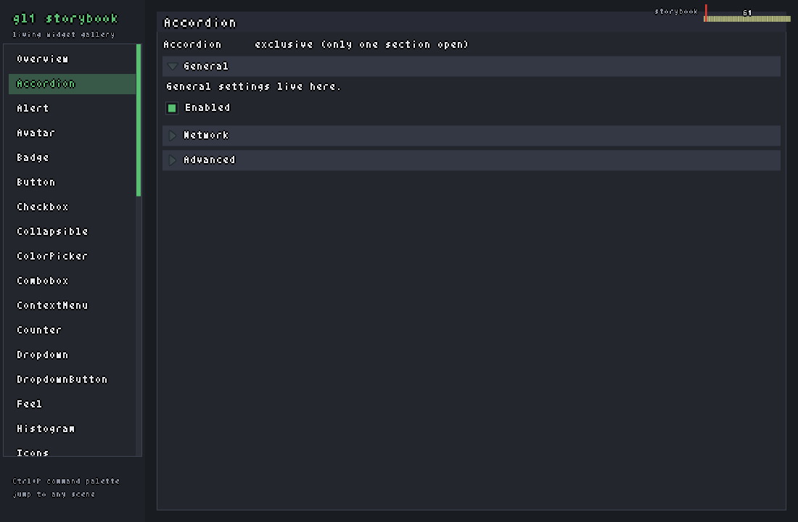

| Option | Type | Notes |
|--------|------|--------|
| `id` | `[]const u8` | Widget id |
| `title` | `[]const u8` | Section header |
| `open_index` | `*i32` | Shared exclusive index (`-1` = none) |
| `index` | `i32` | This section’s index |

`beginAccordion` / `endAccordion` on `Ui`.

---

### alert

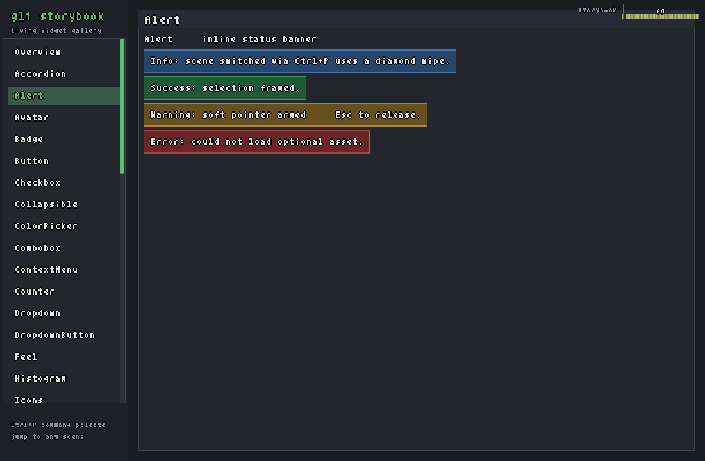

| Option | Type | Notes |
|--------|------|--------|
| `text` | `[]const u8` | Message |
| `kind` | `info` / `ok` / `warn` / `err` | Accent color |

---

### avatar

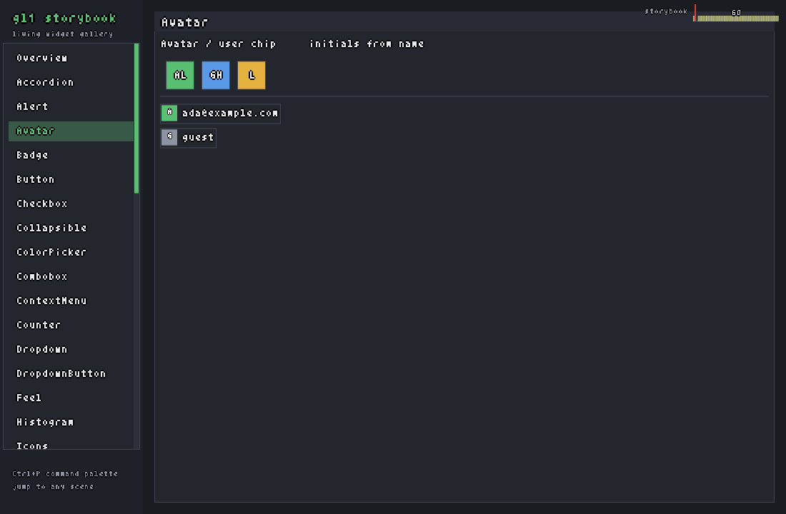

| Option | Type | Notes |
|--------|------|--------|
| `name` | `[]const u8` | Source for initials |
| `size` | `f32` | Plate size (default 32) |
| `color` | `Color` | Optional plate color |
| `label` | `[]const u8` | Optional text beside plate |

`userChip`: compact avatar + name row (`name`, optional `color`).

---

### badge

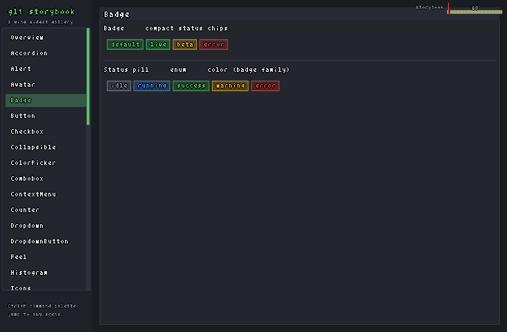

| Option | Type | Notes |
|--------|------|--------|
| `label` | `[]const u8` | Chip text |
| `color` | `Color` | Optional; default theme accent |

---

### button

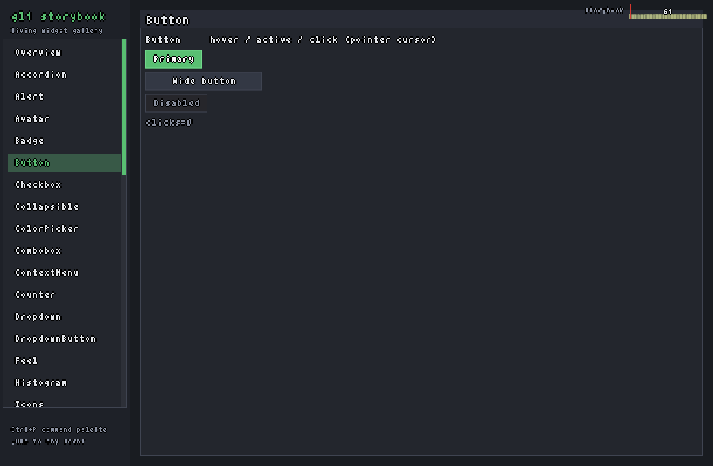

| Option | Type | Notes |
|--------|------|--------|
| `id` | `[]const u8` | |
| `label` | `[]const u8` | |
| `w` | `f32` | 0 = auto width |
| `disabled` | `bool` | |
| `primary` | `bool` | Accent fill + white label |

Returns `true` on click.

---

### checkbox

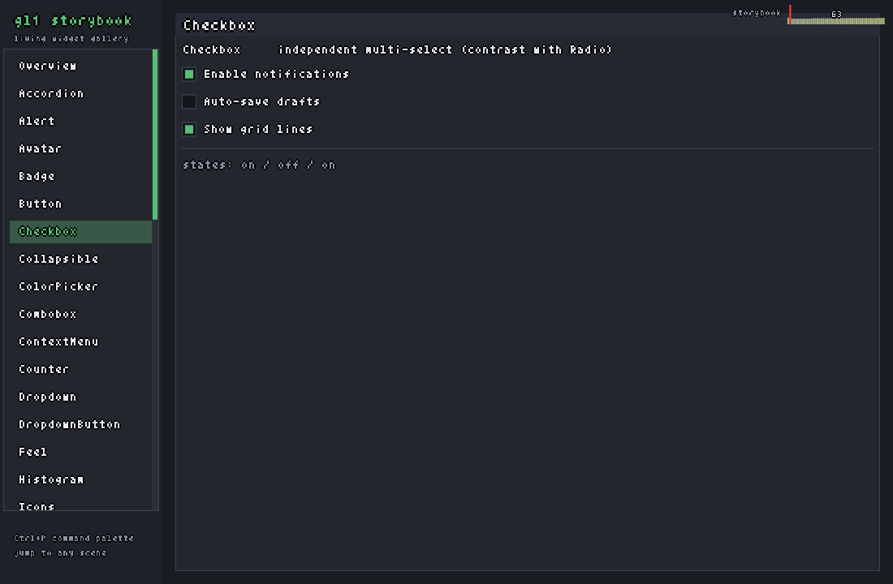

| Option | Type | Notes |
|--------|------|--------|
| `id` | `[]const u8` | |
| `label` | `[]const u8` | |
| `value` | `*bool` | |

---

### colorPicker

Solid fill of the chosen color; rainbow only while scrub-dragging. Click to edit `#hex`.

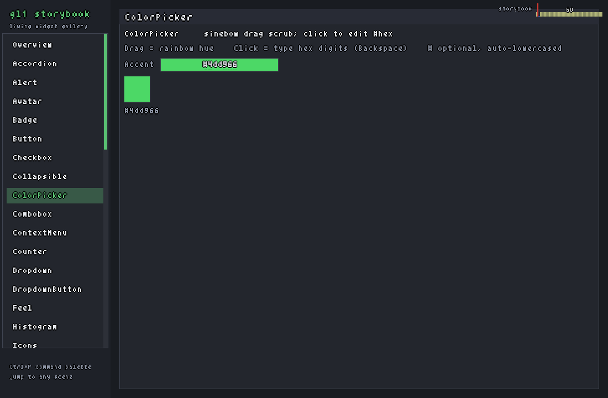

| Option | Type | Notes |
|--------|------|--------|
| `id` | `[]const u8` | |
| `label` | `[]const u8` | |
| `color` | `*Color` | RGBA 0..1 |
| `display_override` | `?[]const u8` | e.g. `"-"` when mixed; disables hex edit |
| `w` | `f32` | Default 200 |

---

### colorSwatch

| Option | Type | Notes |
|--------|------|--------|
| `id` | `[]const u8` | |
| `color` | `Color` | Fill |
| `selected` | `bool` | Accent border |
| `w` | `f32` | Square size (default 28) |

---

### counter

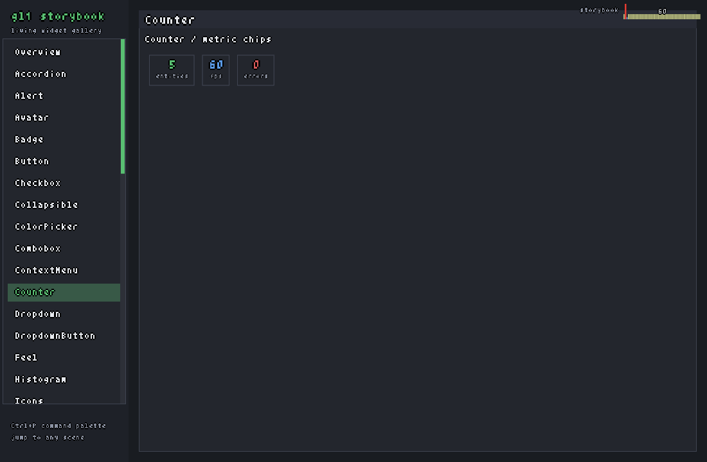

| Option | Type | Notes |
|--------|------|--------|
| `label` | `[]const u8` | Caption under number |
| `value` | number | Or `text` override string |
| `color` | `Color` | Optional accent for number |

---

### dropdown

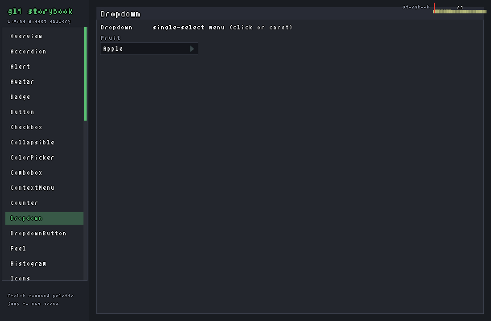

| Option | Type | Notes |
|--------|------|--------|
| `id` | `[]const u8` | |
| `label` | `[]const u8` | |
| `items` | `[]const []const u8` | |
| `selected` | `*usize` | |
| `open` | `*bool` | Menu open state |
| `w` | `f32` | Default 200 |

---

### dropdownButton

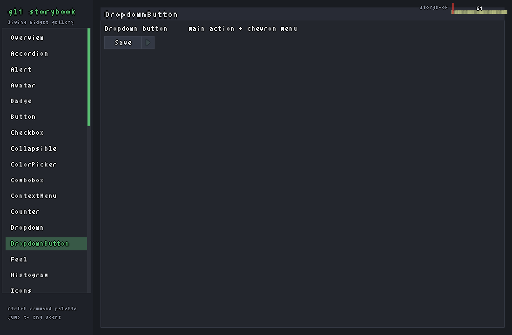

| Option | Type | Notes |
|--------|------|--------|
| `id` | `[]const u8` | |
| `label` | `[]const u8` | Main action label |
| `items` | `[]const []const u8` | Chevron menu entries |
| `open` | `*bool` | |
| `w` | `f32` | Optional total width |

Returns `?i32`: `null` none, `-1` main click, `≥0` menu index.

---

### histogram

Scrolling cold→hot bars; transparent background; centered numeric overlay.

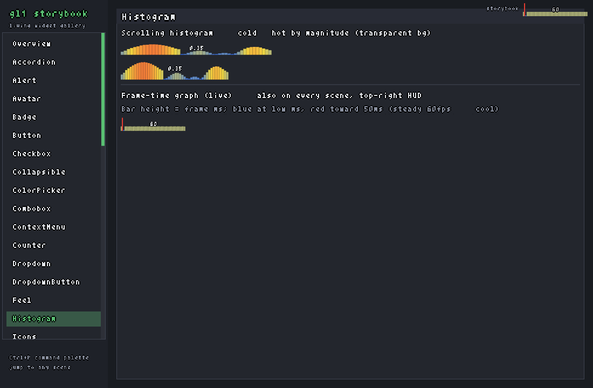

| Option | Type | Notes |
|--------|------|--------|
| `samples` | `[]const f32` | Oldest → newest |
| `w` / `h` | `f32` | Default 120×24 |
| `max_value` | `f32` | Scale for color/height |
| `overlay` | `[]const u8` | Optional centered label (e.g. `"60"`) |

HUD also uses `histogramAt` for absolute placement (global frame-time graph).

---

### imageWell

Checkerboard under PNG alpha; fit / stretch / fill.

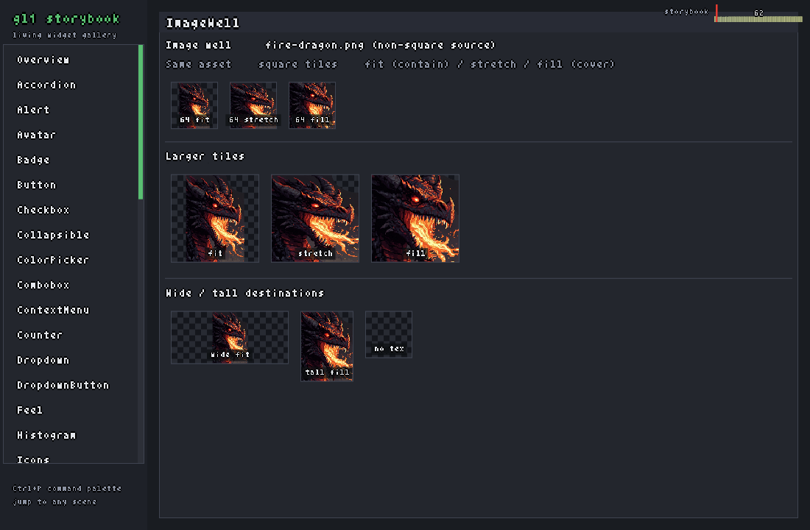

| Option | Type | Notes |
|--------|------|--------|
| `w` / `h` | `f32` | Tile size |
| `tex` | `?*const Tex` | Optional loaded texture |
| `fit` | `.fit` / `.stretch` / `.fill` | Default `.fit` |
| `label` | `[]const u8` | Optional caption |
| `border` | `bool` | Default true |

---

### keyValueEditor

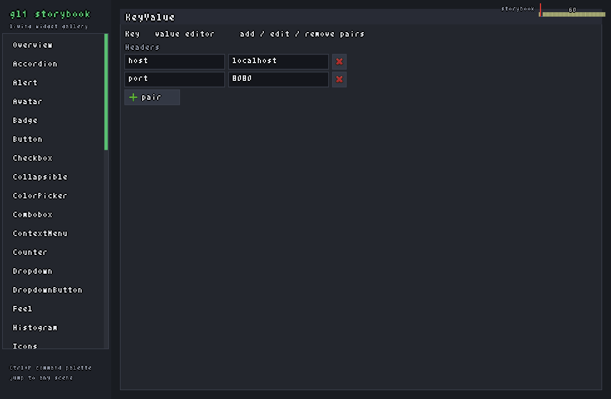

| Option | Type | Notes |
|--------|------|--------|
| `id` | `[]const u8` | |
| `label` | `[]const u8` | |
| `keys` / `vals` | `[][32]u8` | Pair buffers |
| `key_lens` / `val_lens` | `[]usize` | |
| `count` | `*usize` | Active pair count |
| `w` | `f32` | |

---

### label

| Option | Type | Notes |
|--------|------|--------|
| `text` | `[]const u8` | |
| `color` | `?Color` | Default theme text |
| `size` | `?f32` | Default theme font size |

---

### link

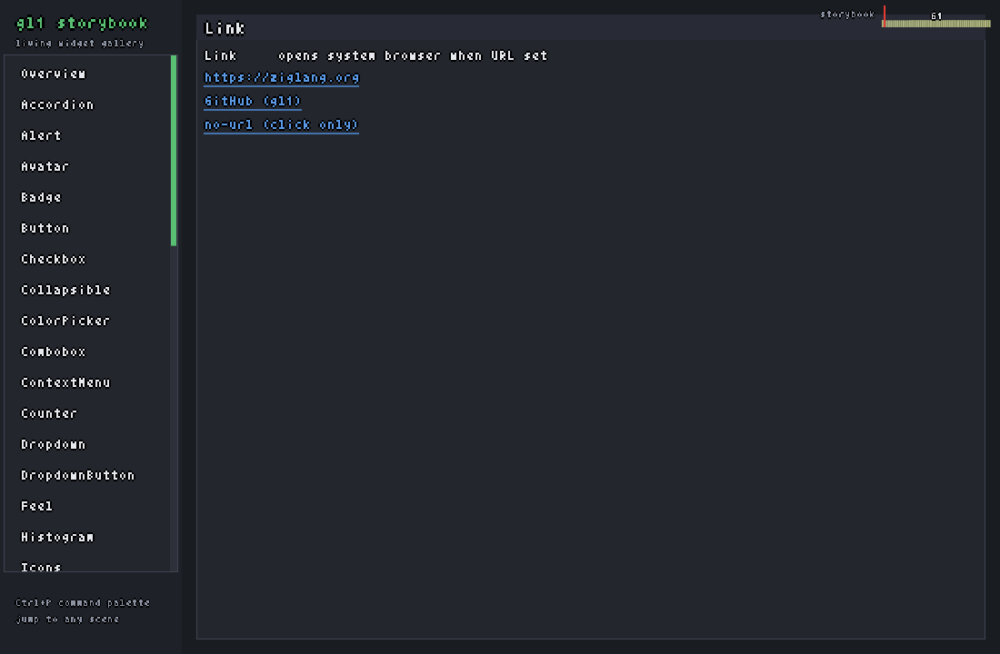

| Option | Type | Notes |
|--------|------|--------|
| `id` | `[]const u8` | |
| `label` | `[]const u8` | Display text |
| `url` | `[]const u8` | Opens via system browser if non-empty |
| `size` | `?f32` | |

---

### listBox

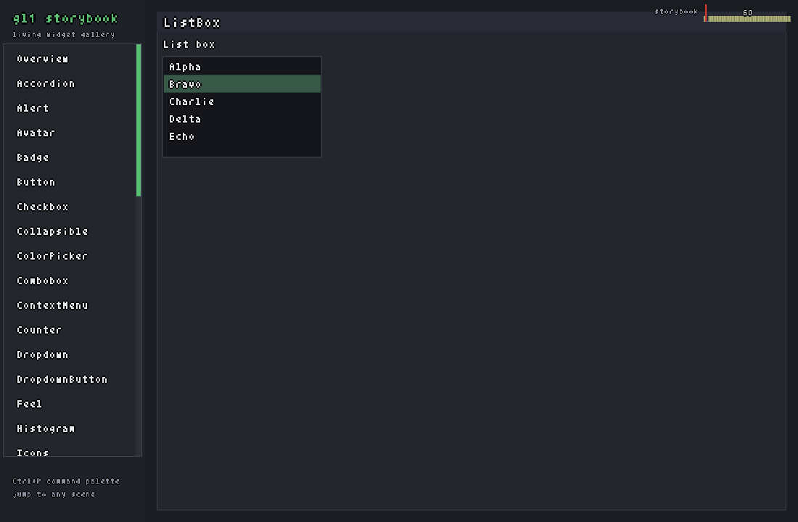

| Option | Type | Notes |
|--------|------|--------|
| `id` | `[]const u8` | |
| `items` | `[]const []const u8` | |
| `selected` | `*usize` | |
| `w` / `h` | `f32` | |

`listBoxNav` adds keyboard ↑/↓ when focused.

---

### multiSelect

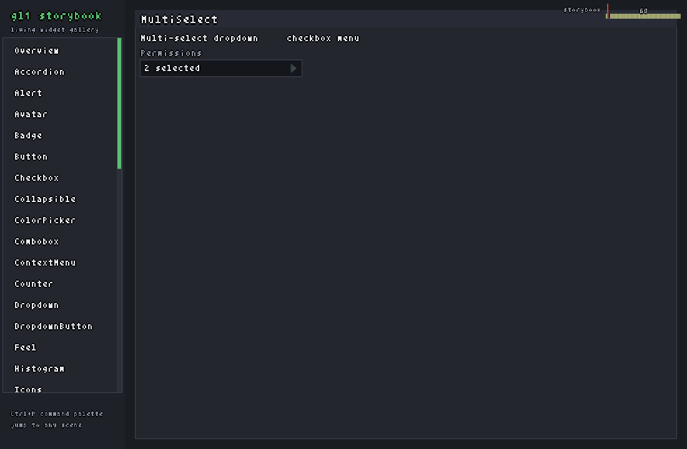

| Option | Type | Notes |
|--------|------|--------|
| `id` | `[]const u8` | |
| `label` | `[]const u8` | |
| `items` | `[]const []const u8` | |
| `selected` | `[]bool` | Parallel to items |
| `open` | `*bool` | |
| `w` | `f32` | |

---

### passwordInput

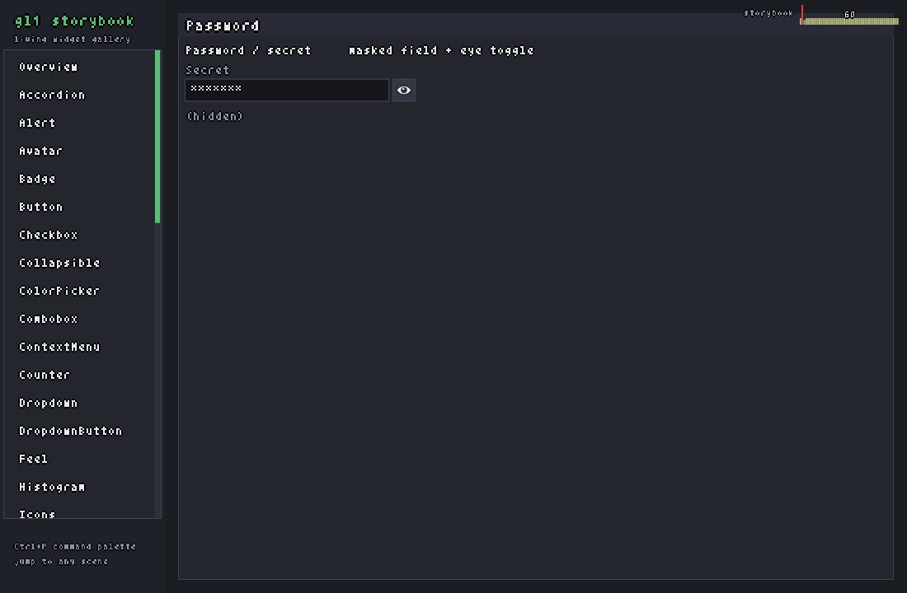

| Option | Type | Notes |
|--------|------|--------|
| `id` | `[]const u8` | |
| `label` | `[]const u8` | |
| `buf` / `len` | buffer | Secret text |
| `show` | `*bool` | Reveal toggle |
| `w` | `f32` | |

---

### progress

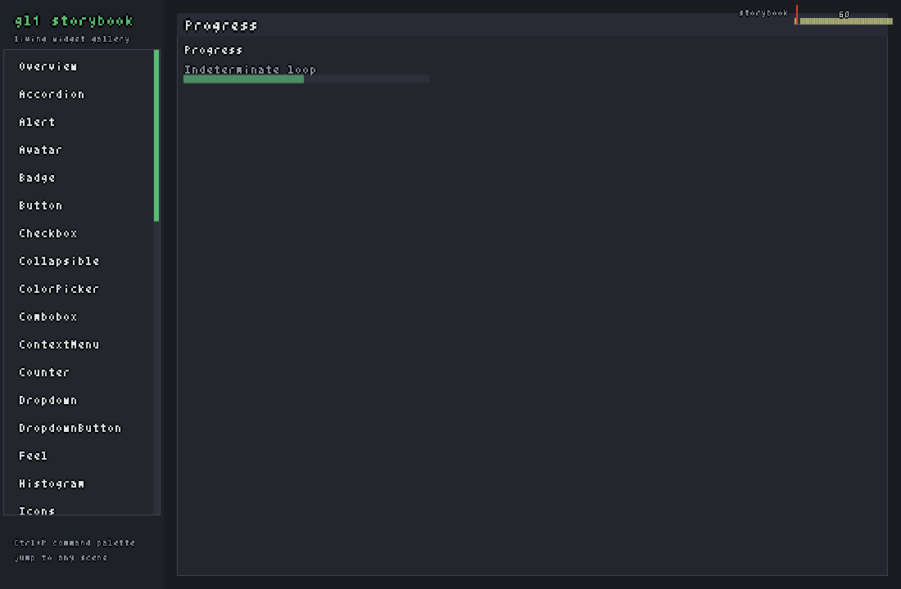

| Option | Type | Notes |
|--------|------|--------|
| `label` | `[]const u8` | |
| `value` | `f32` | 0..1 |
| `w` | `f32` | Default 200 |

---

### radio

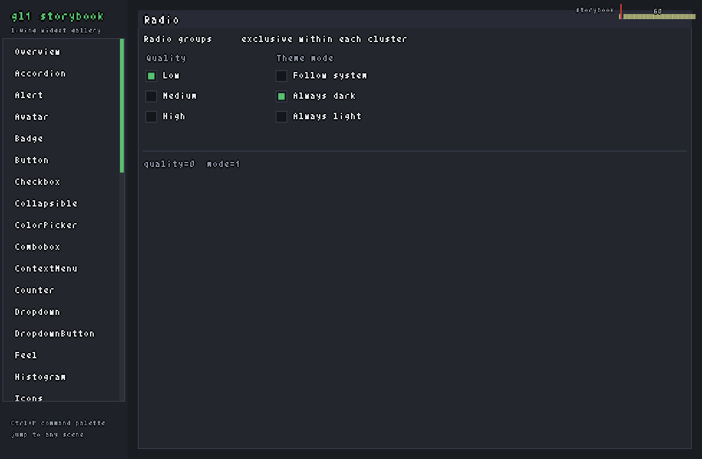

| Option | Type | Notes |
|--------|------|--------|
| `id` | `[]const u8` | |
| `label` | `[]const u8` | |
| `group` | `*u32` | Shared group state |
| `value` | `u32` | This option’s value |

---

### requestButton

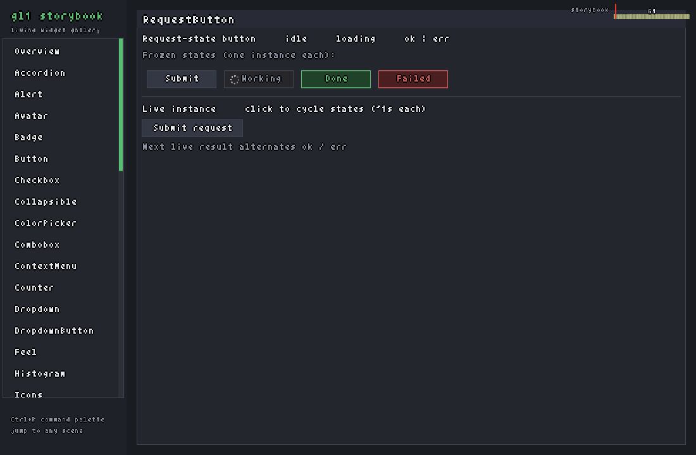

| Option | Type | Notes |
|--------|------|--------|
| `id` | `[]const u8` | |
| `label` / `label_loading` / `label_ok` / `label_err` | `[]const u8` | Per-state labels |
| `state` | `*State` | Live: `.idle` / `.loading` / `.ok` / `.err` |
| `force` | `State` | Frozen display (not clickable) |
| `w` | `f32` | |

Returns `true` when idle and clicked.

---

### searchField

| Option | Type | Notes |
|--------|------|--------|
| `id` | `[]const u8` | |
| `buf` / `len` | buffer | |
| `placeholder` | `[]const u8` | Shown when empty + unfocused |
| `w` | `f32` | |

---

### segmented

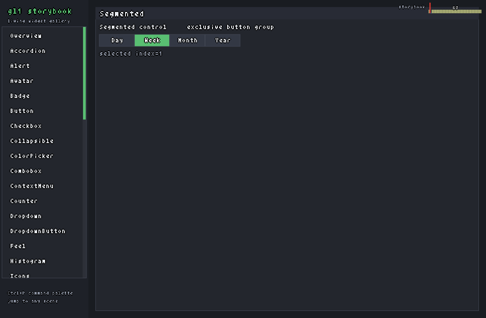

| Option | Type | Notes |
|--------|------|--------|
| `id` | `[]const u8` | |
| `items` | `[]const []const u8` | Segment labels |
| `selected` | `*usize` | |
| `w` | `f32` | Total width |

---

### separator / spacer

| Component | Options |
|-----------|---------|
| `separator` | (none) — horizontal rule |
| `spacer(h)` | `h: f32` — vertical gap |

---

### slider

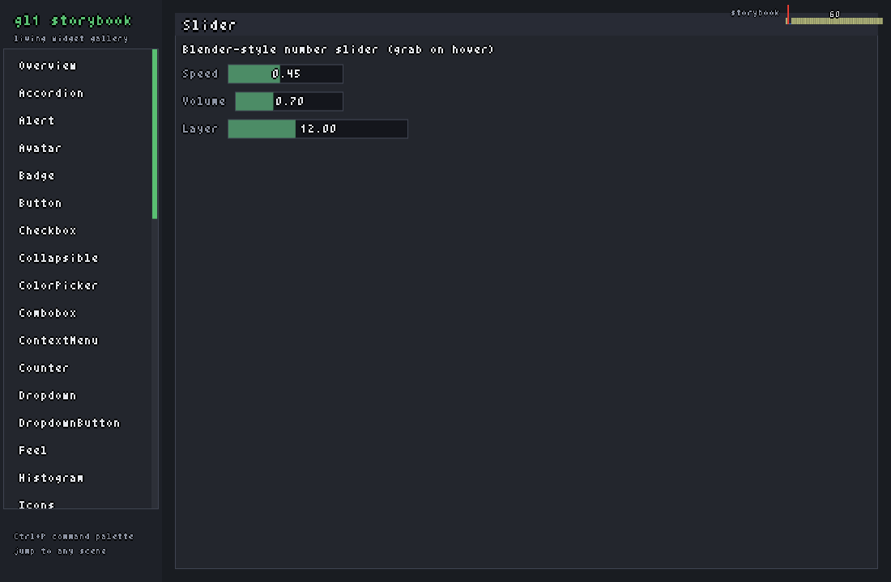

| Option | Type | Notes |
|--------|------|--------|
| `id` | `[]const u8` | |
| `label` | `[]const u8` | |
| `value` | `*f32` | |
| `min` / `max` | `f32` | Default 0..1 |
| `w` | `f32` | Default 200 |
| `display_override` | `?[]const u8` | e.g. mixed multi-edit |

---

### spinner


| Option | Type | Notes |
|--------|------|--------|
| `size` | `f32` | Default 22 |
| `label` | `[]const u8` | Optional |

---

### statusPill

Shown on the Badge storybook page.

| Option | Type | Notes |
|--------|------|--------|
| `kind` | `idle` / `running` / `success` / `warning` / `error_` | Color map |
| `label` | `[]const u8` | Optional override |

---

### table

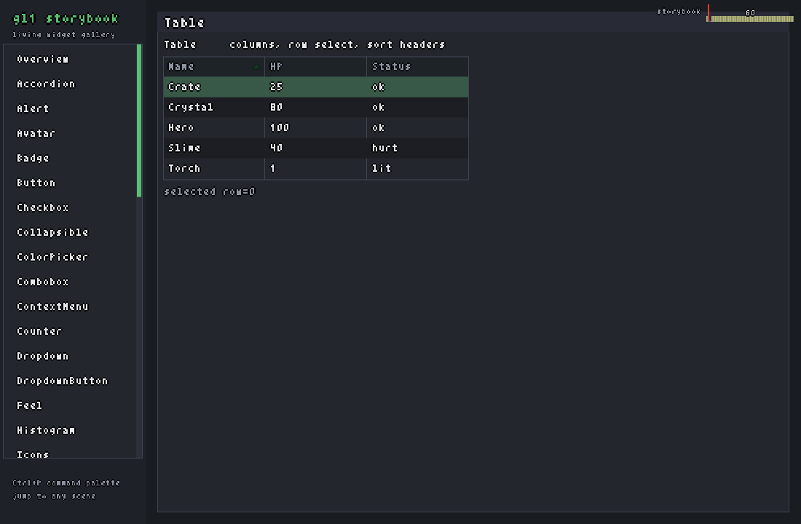

| Option | Type | Notes |
|--------|------|--------|
| `id` | `[]const u8` | |
| `columns` | `[]const []const u8` | Header labels |
| `cells` | `[]const []const []const u8` | `cells[row][col]` |
| `selected` | `*i32` | Optional row selection |
| `sort_col` / `sort_asc` | `*usize` / `*bool` | Optional header sort |
| `w` | `f32` | |
| `nrows` | `usize` | Optional; default `cells.len` |

---

### tabs

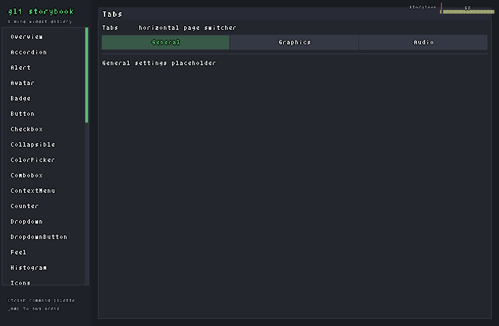

| Option | Type | Notes |
|--------|------|--------|
| `id` | `[]const u8` | |
| `items` | `[]const []const u8` | |
| `selected` | `*usize` | |
| `w` | `f32` | 0 = natural |

---

### tagInput

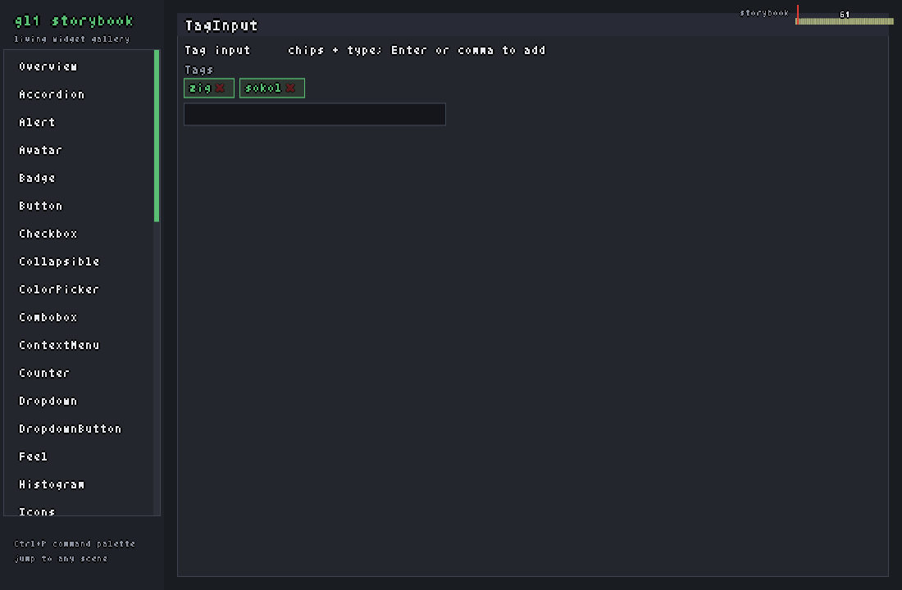

| Option | Type | Notes |
|--------|------|--------|
| `id` | `[]const u8` | |
| `label` | `[]const u8` | |
| `tags` / `tag_lens` / `tag_count` | buffers | Chip storage |
| `buf` / `len` | entry field | Enter / comma commits |
| `w` | `f32` | |

---

### textInput / textArea / textFieldCore

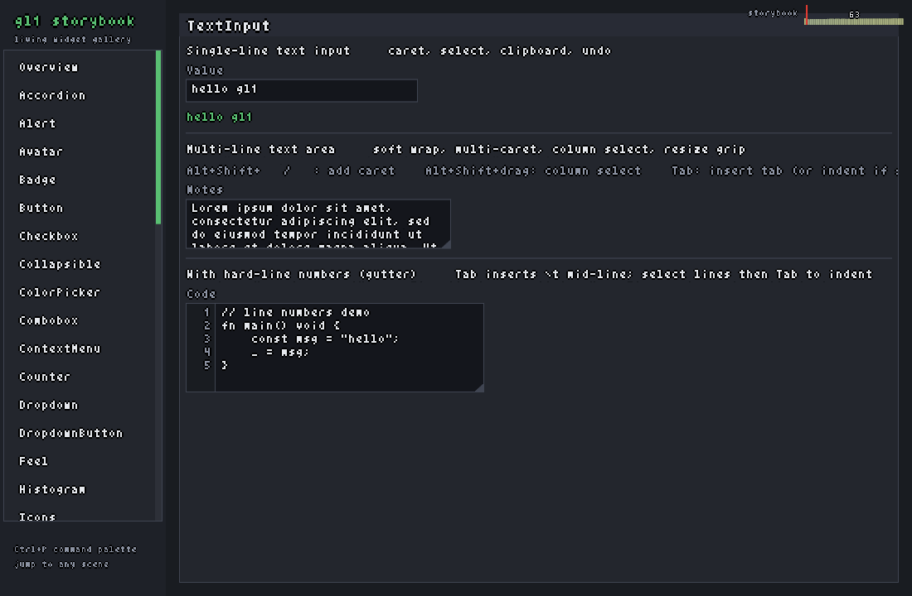

**textInput**

| Option | Type | Notes |
|--------|------|--------|
| `id` | `[]const u8` | |
| `label` | `[]const u8` | |
| `buf` / `len` | buffer | |
| `w` | `f32` | Default 220 |

**textArea**

| Option | Type | Notes |
|--------|------|--------|
| `id` | `[]const u8` | |
| `label` | `[]const u8` | |
| `buf` / `len` | buffer | |
| `w` | `f32` | |
| `rows` | `u32` | Default height in lines |
| `min_height` / `max_height` / `h` | `f32` | |
| `line_numbers` | `bool` | Hard-line gutter |

**textFieldCore** — shared engine (mouse, multi-caret, soft wrap, selection); not usually called from scenes.

---

### toggle

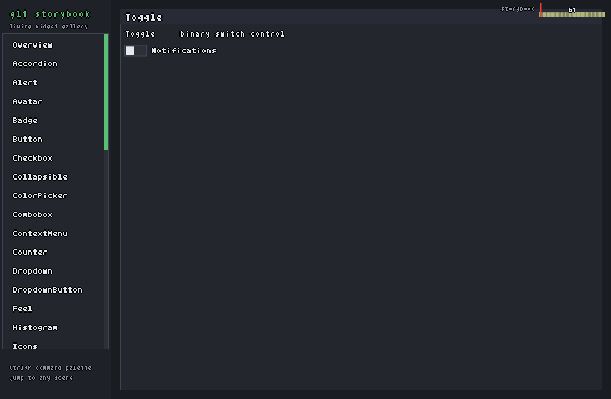

| Option | Type | Notes |
|--------|------|--------|
| `id` | `[]const u8` | |
| `label` | `[]const u8` | |
| `value` | `*bool` | |

---

### typeahead / combobox

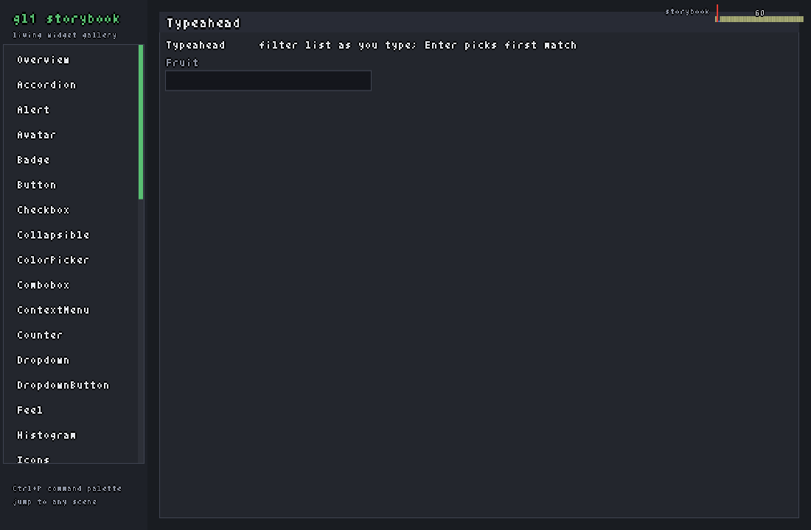

| Option | Type | Notes |
|--------|------|--------|
| `id` | `[]const u8` | |
| `label` | `[]const u8` | |
| `buf` / `len` | buffer | Query / value |
| `items` | `[]const []const u8` | Candidates |
| `selected` / `highlight` | `*usize` | Optional |
| `w` | `f32` | |
| `show_all_when_empty` | `bool` | Combobox sets true |

↑/↓ move highlight; **Enter** commits; **Tab** injects first match.

---

### Other storybook demos (layout chrome)

These are mostly `Ui` helpers rather than single widget files:

| Storybook tab | Screenshot | Notes |
|---------------|------------|--------|
| Collapsible | 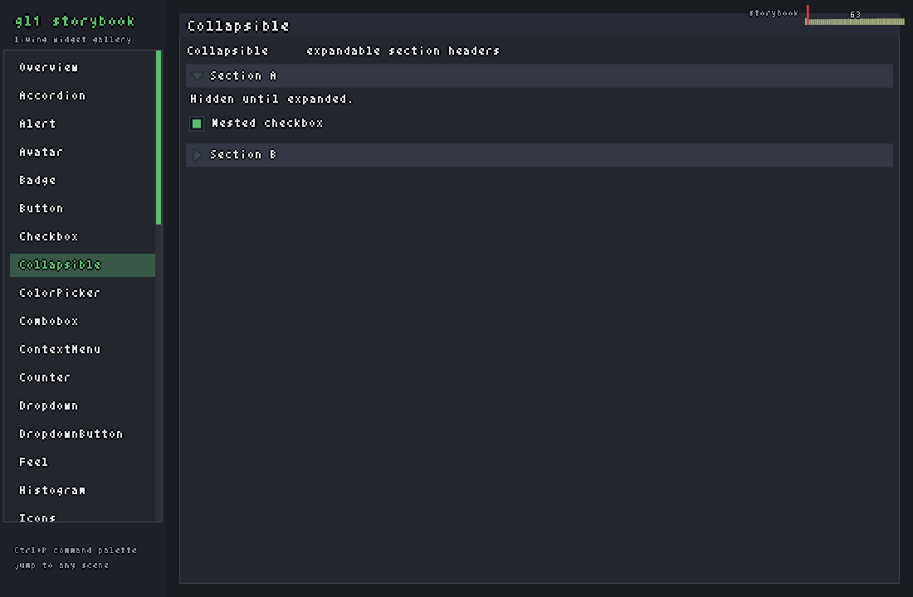 | `beginCollapsible` / `endCollapsible` |
| IconButton | 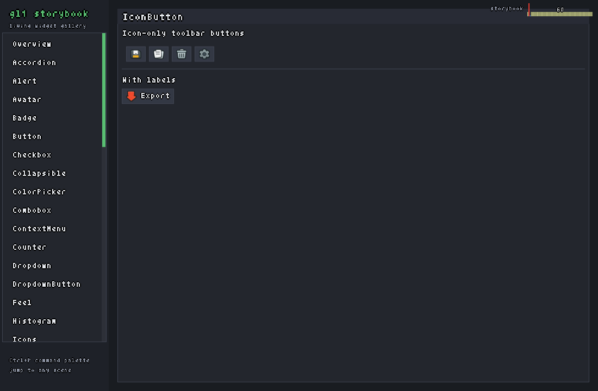 | `ui.iconButton` — icon ± label |
| Layout | 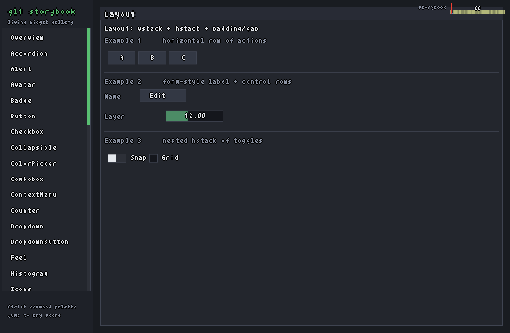 | HStack / VStack |
| Menubar | 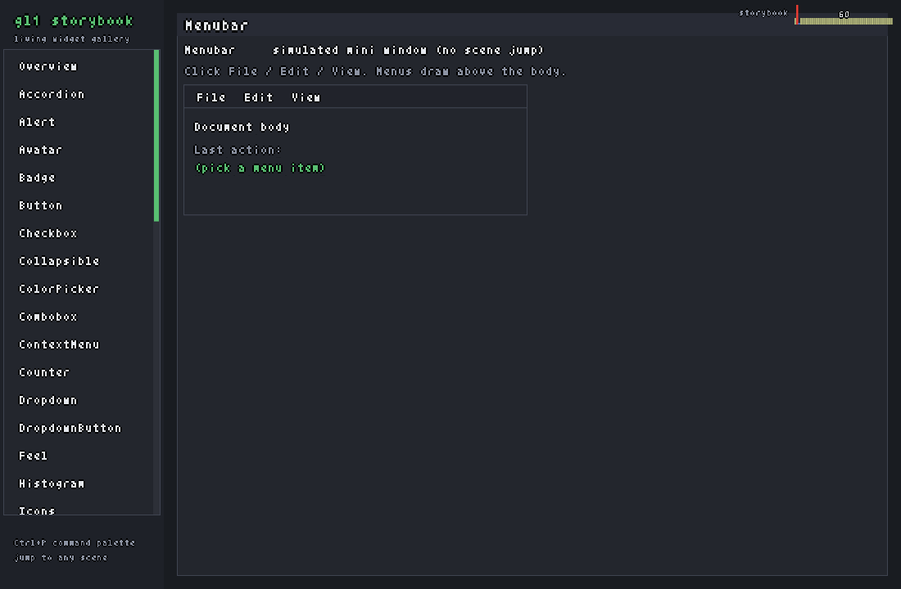 | Menu strip + dropdowns |
| Modal | 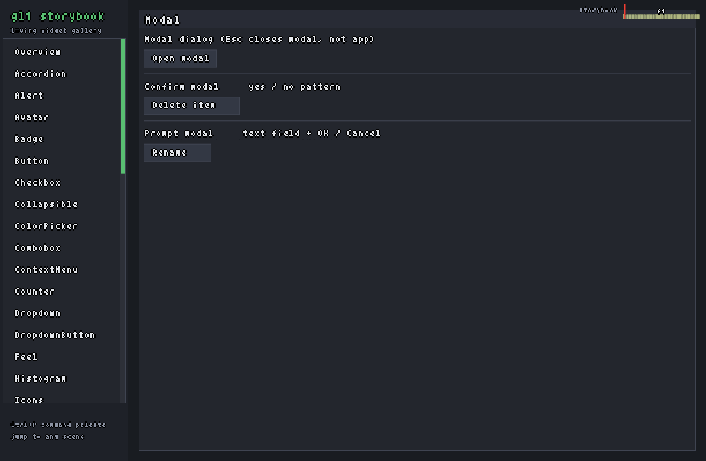 | `beginModal` + confirm/prompt patterns |
| Panel | 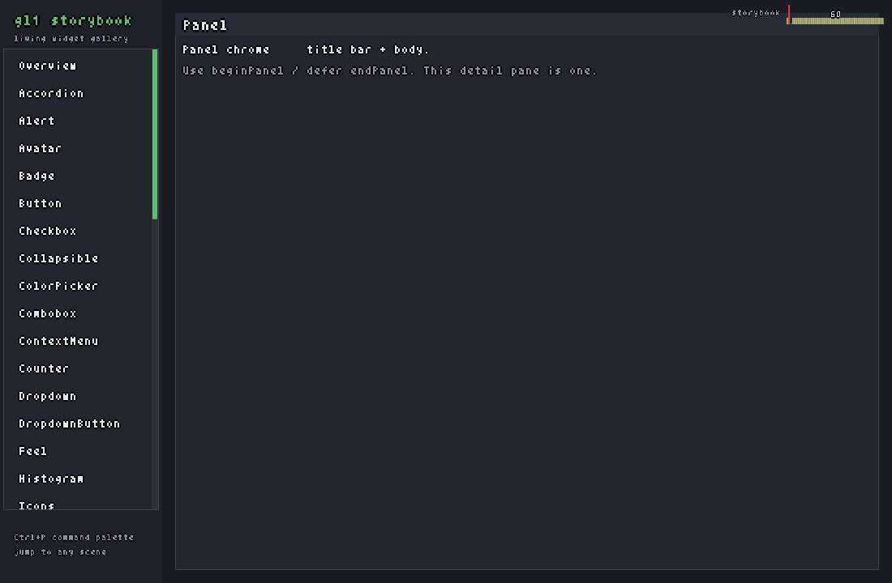 | `beginPanel` chrome |
| Scroll | 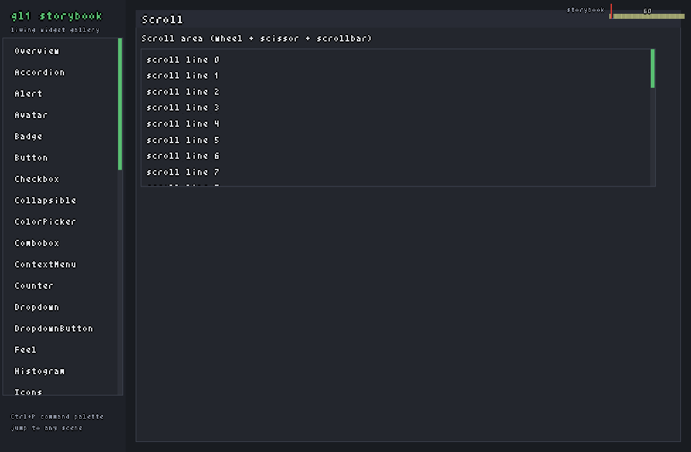 | `beginScroll` / elastic overscroll |
| Toast | 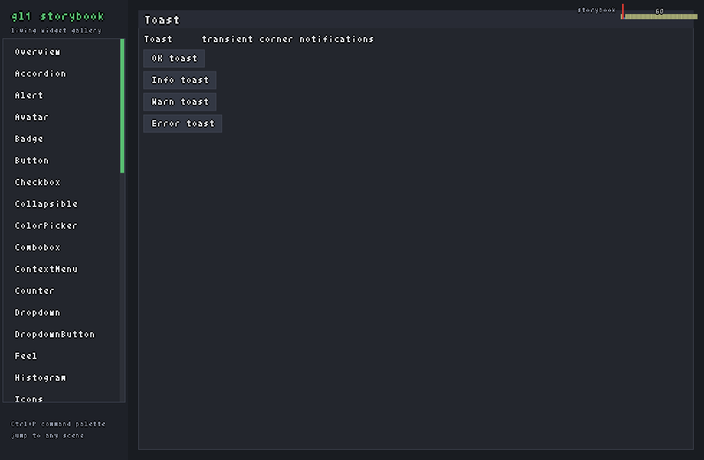 | `ui.toast` stack |
| Tree | 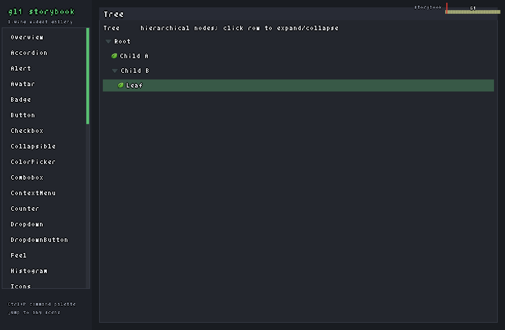 | `ui.treeNode` |

---

## Text editing hotkeys

Focused single-line (`textInput`) and multi-line (`textArea`) fields:

| Input | Action |
|-------|--------|
| Arrows / Home / End | Move caret (Ctrl+arrow = word) |
| Shift+arrows | Extend selection |
| Double-click | Select word |
| Triple-click | Select line (multi-line) |
| **Ctrl+D** | Add next occurrence (first press: select word if empty) |
| **Ctrl+Shift+L** | Select all occurrences |
| **Alt+Shift+↑/↓** or **Ctrl+Alt+↑/↓** | Add caret above/below |
| **Ctrl+Shift+drag** or **middle-drag** | Column / block selection |
| **Ctrl+Backspace / Delete** | Delete previous / next word |
| **Home** / **End** | Soft-wrap aware visual / hard line |
| **Tab** | Multi-line: insert `\t` (or indent if selection); Shift+Tab outdent |
| **Esc** | End multi-caret / Ctrl+D / block session |
| **Enter** | Newline (multi-line) |

Tab characters expand to `font.tab_columns` spaces (default **4**). Textarea: SE **triangle** grip resizes (ghost preview while dragging).

---

## Global hotkeys

| Input | Action |
|-------|--------|
| **Ctrl+P** | Toggle command palette |
| **Esc** | Close palette/modal → clear text focus → release soft pointer → quit |
| **Ctrl+C / X / V** | Copy / cut / paste in text fields |
| **Ctrl+Z** / **Ctrl+Shift+Z** | Undo / redo in text fields |

Top-right HUD: scene name + **frame-time histogram** (bar height = ms; cold→hot color; overlay = latest FPS as a bare number).

---

## Regenerating screenshots

```bash
zig build
mkdir -p docs/screenshots docs/screenshots/components

# Scenes (use a new suffix when publishing to bust GH Pages cache)
for s in canvas storybook text triangle panels; do
  ./zig-out/bin/gl1 --scene "$s" --auto-quit 1.8 &
  pid=$!
  sleep 1.4
  scrot -u -o "docs/screenshots/${s}-v2.png"
  wait $pid 2>/dev/null
done

# Storybook component tabs
for t in Button ColorPicker Table ImageWell Histogram RequestButton; do
  slug=$(echo "$t" | tr '[:upper:]' '[:lower:]')
  ./zig-out/bin/gl1 --story-tab "$t" --auto-quit 1.6 &
  pid=$!
  sleep 1.2
  scrot -u -o "docs/screenshots/components/${slug}-v1.png"
  wait $pid 2>/dev/null
done
```
