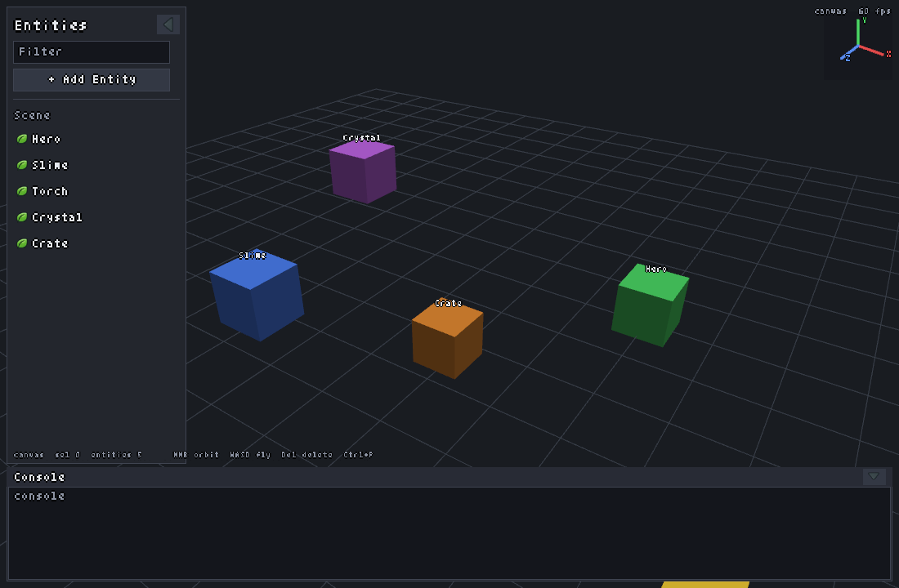
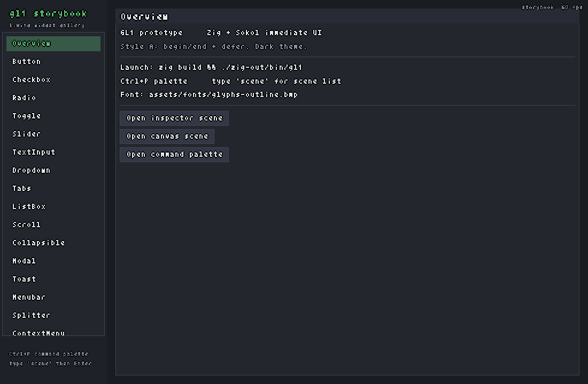
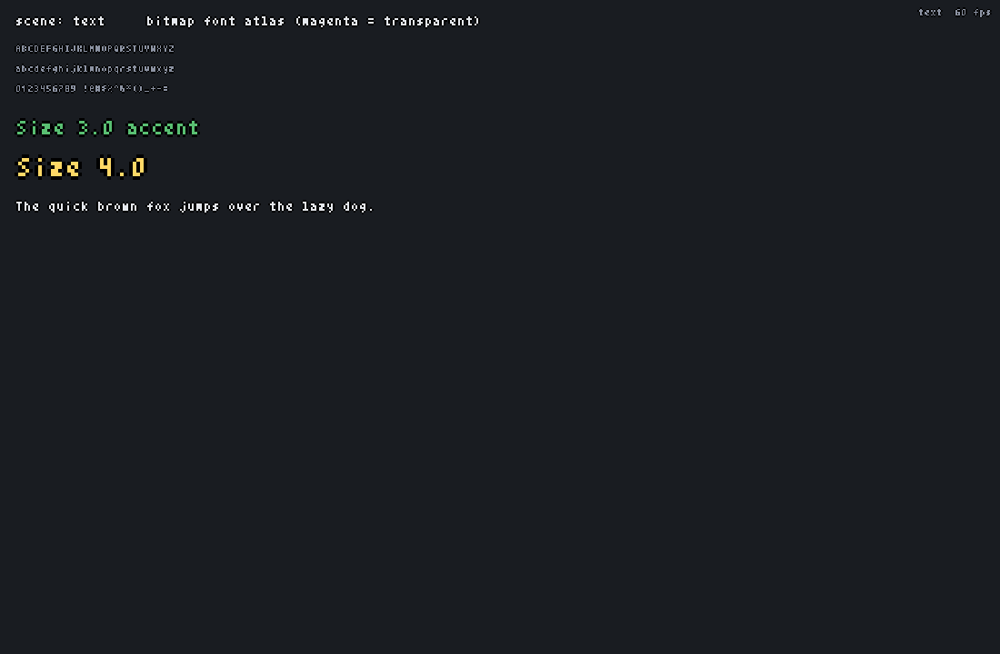
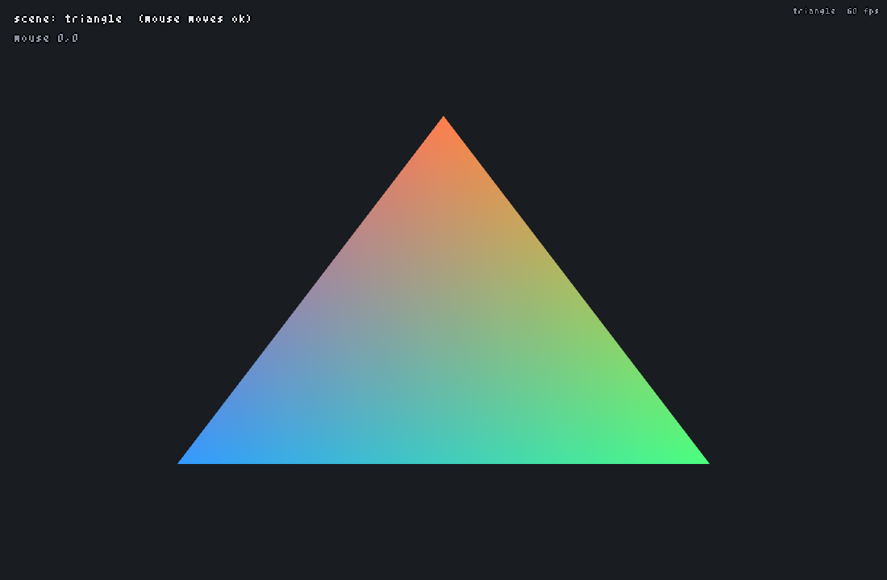
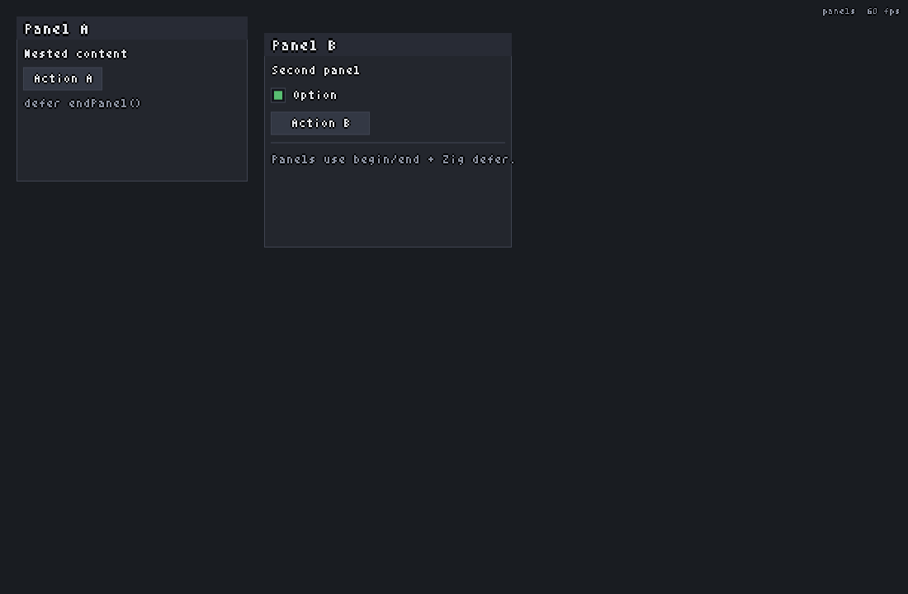

# gl1

Portable **Zig + Sokol** graphics prototype with a custom **immediate-mode UI**. Built as a greenfield stack for tools,
editors, and eventually TUI backends—with little/no dependencies.

## Requirements

- Zig **master** via [`zvm`](https://github.com/tristanisham/zvm)  
  (tested: `0.17.0-dev.1252+e4b325c19`)
- [sokol-zig](https://github.com/floooh/sokol-zig) (`sokol_app` + `sokol_gfx` + `sokol_gl`) |
- Linux with OpenGL + X11 (macOS / Windows via Sokol backends later)

## Build & Run

```bash
zvm use master
zig build
./zig-out/bin/gl1 
```
---

## Scenes overview

Favorite demos first:

| Scene | CLI | Description |
|-------|-----|-------------|
| [`storybook`](#storybook) | `--scene storybook` | Living widget gallery (**default**) |
| [`canvas`](#canvas) | `--scene canvas` | 3D orbit viewport + editor chrome (tree / inspector / console) |
| [`panels`](#panels) | `--scene panels` | Desktop windows + dock (drag / resize / toggle) |
| [`text`](#text) | `--scene text` | Bitmap font sample |
| [`triangle`](#triangle) | `--scene triangle` | Hello triangle + mouse readout |

---

## Scene gallery

### canvas

Mini Blender-like **3D** viewport: orbit camera, solid cubes as ECS-style
entities, selection outlines, orientation compass, fly mode, plus floating
**scene tree**, **inspector**, and **console** panels.



| Input | Action |
|-------|--------|
| **MMB drag** | Orbit (yaw / pitch only; no snap on click) |
| **Shift+MMB drag** | Strafe (pan in camera plane) |
| **Space+LMB drag** | Pan look-target |
| **Wheel** | Dolly (distance) |
| **WASD** | Fly forward / left / back / right |
| **Q** / **E** | Fly down / up |
| **Space** | Fly up (when not Space+LMB panning) |
| **Shift** | Faster fly |
| **LMB** | Select entity (mesh only) |
| **Ctrl/Shift+LMB** | Multi-select toggle |
| **Ctrl+A** | Toggle select all / none |
| **F** or **Numpad `.`** | Frame selection (center + zoom ~80%, 250 ms tween) |
| **1** / **3** / **7** | Front / Right / Top view (numpad or top-row) |
| Top-right RGB gizmo | World-axis orientation (shifts left of expanded inspector) |
| **Del** | Delete selection (when not typing in a field) |

---

### storybook

Widget gallery with a sidebar index. Default launch scene.



| Input | Action |
|-------|--------|
| Click sidebar row | Open that widget’s playground |
| Scroll sidebar / detail | Wheel when hovered (scissor-clipped) |
| **Ctrl+P** | Command palette |

---

### text

Bitmap font atlas demo (magenta chroma key → transparency).



| Input | Action |
|-------|--------|
| — | View only |

---

### triangle

Minimal Sokol GL triangle and mouse position HUD.



| Input | Action |
|-------|--------|
| Move mouse | Updates on-screen position readout |

---

### panels

Lightweight **desktop**: floating windows, title-bar drag, bottom-right resize
triangle, and a macOS-style dock that opens/closes windows while **remembering
position and size**.



| Input | Action |
|-------|--------|
| Drag window title bar | Move window |
| Drag bottom-right triangle | Resize window |
| Click dock icon | Toggle window open/closed (geometry preserved) |
| Wheel over window body | Scroll clipped content |

---

## Text editing hotkeys

Focused single-line (`textInput`) and multi-line (`textArea`) fields:

| Input | Action |
|-------|--------|
| Arrows / Home / End | Move caret (Ctrl+arrow = word) |
| Shift+arrows | Extend selection |
| Double-click | Select word |
| Triple-click | Select line (multi-line) |
| **Ctrl+D** | Add next occurrence (first press: select word if empty) |
| **Ctrl+Shift+L** | Select all occurrences |
| **Alt+Shift+↑/↓** or **Ctrl+Alt+↑/↓** | Add caret above/below |
| **Ctrl+Shift+drag** or **middle-drag** | Column / block selection (Alt+Shift+drag when WM allows; arrows grow block) |
| **Ctrl+Backspace / Delete** | Delete previous / next word |
| **Home** / **End** | Soft-wrap aware: visual line, then hard line (smart first non-ws) |
| **Tab** / **Shift+Tab** | Indent / outdent (multi-line; two spaces) |
| **Esc** | End multi-caret / Ctrl+D / block session (restore origin caret) |
| **Enter** | Newline (multi-line) |
| Soft wrap | Display-only; buffer keeps real newlines only |

Textarea: bottom-right **solid triangle** grip resizes the field (ghost preview while dragging).

---

## Global hotkeys

| Input | Action |
|-------|--------|
| **Ctrl+P** | Toggle command palette (filter with e.g. `scene`, arrows / Enter / click) |
| **Esc** | Close palette/modal → clear text focus → quit app |
| **Ctrl+C / X / V** | Copy / cut / paste in focused text fields |
| **Ctrl+Z** / **Ctrl+Shift+Z** | Undo / redo in text fields |

Scene switching is via the palette (type `scene`). Digits stay free for typing.

### Command palette

| Input | Action |
|-------|--------|
| **↑ / ↓** | Move selection (scroll keeps selection in view) |
| **Mouse wheel** | Scroll list only (does not change selection) |
| **Mouse move over row** | Select that row (only while the mouse is moving) |
| **Enter** / click | Run command |
| **Esc** | Close palette |
