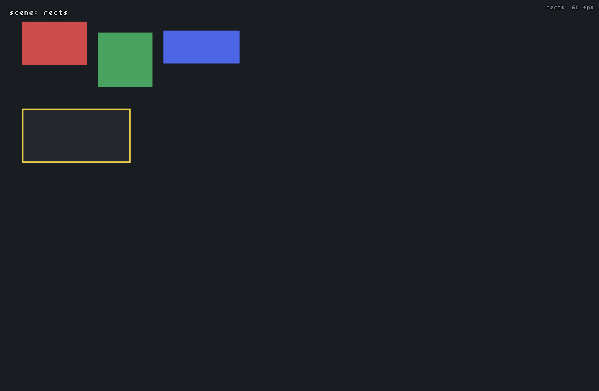
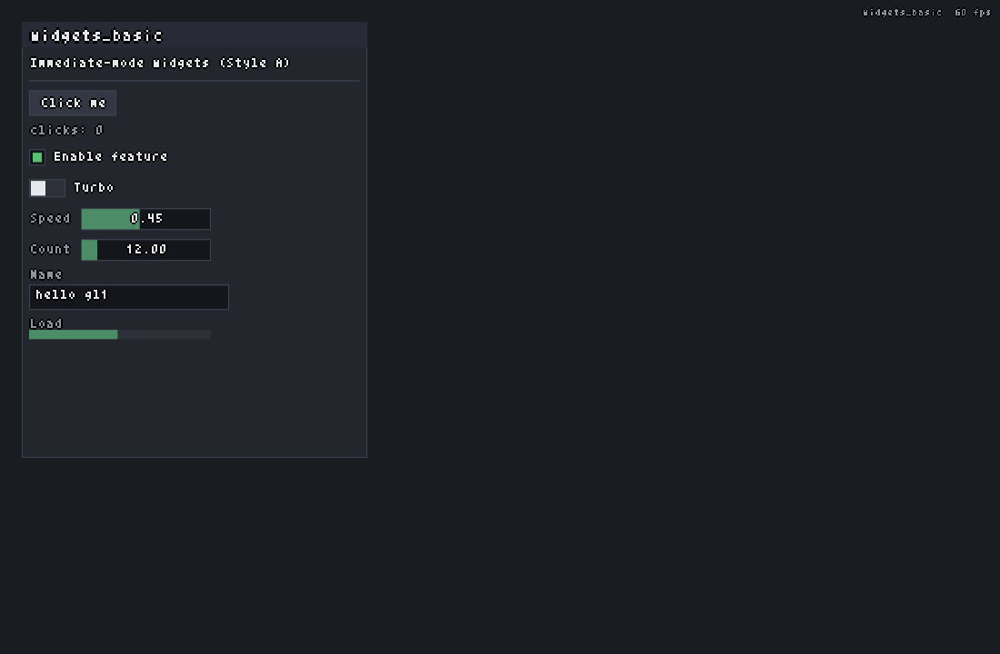
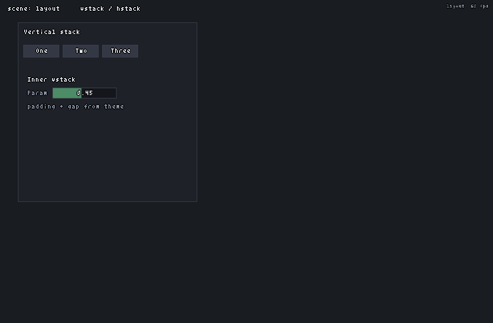

# gl1

Portable **Zig + Sokol** graphics prototype with a custom **immediate-mode UI**
(Style A: `begin` / `end` + `defer`). Built as a greenfield stack for tools,
editors, and eventually TUI backends—without shipping Dear ImGui or Clay as the
product UI.

| | |
|--|--|
| Language | Zig **master** ([zvm](https://github.com/tristanisham/zvm)) |
| Window / GPU | [sokol-zig](https://github.com/floooh/sokol-zig) (`sokol_app` + `sokol_gfx` + `sokol_gl`) |
| UI | In-repo immediate mode (`src/ui/`) + `RenderCommand` list |
| Font | Bitmap atlas (`assets/fonts/glyphs-outline.bmp`) |
| Default scene | `storybook` |


## Requirements

- Zig **master** via [`zvm`](https://github.com/tristanisham/zvm)  
  (tested: `0.17.0-dev.1252+e4b325c19`)
- Linux with OpenGL + X11 (macOS / Windows via Sokol backends later)

```bash
zvm use master
zig build
./zig-out/bin/gl1                    # default: storybook
./zig-out/bin/gl1 --scene canvas
./zig-out/bin/gl1 help
```

## Global hotkeys

| Input | Action |
|-------|--------|
| **Ctrl+P** | Toggle command palette (filter with e.g. `scene`, arrows / Enter / click) |
| **Esc** | Close palette/modal → clear text focus → quit app |
| **Ctrl+C / X / V** | Copy / cut / paste in focused text fields |
| **Ctrl+Z** / **Ctrl+Shift+Z** | Undo / redo in text fields |

Scene switching is via the palette (type `scene`). Digits stay free for typing.

### Command palette

| Input | Action |
|-------|--------|
| **↑ / ↓** | Move selection (scroll keeps selection in view) |
| **Mouse wheel** | Scroll list only (does not change selection) |
| **Mouse move over row** | Select that row (only while the mouse is moving) |
| **Enter** / click | Run command |
| **Esc** | Close palette |

---

## Scenes overview

| Scene | CLI | Description |
|-------|-----|-------------|
| [`storybook`](#storybook) | `--scene storybook` | Living widget gallery (**default**) |
| [`triangle`](#triangle) | `--scene triangle` | Hello triangle + mouse readout |
| [`rects`](#rects) | `--scene rects` | Colored rectangles |
| [`text`](#text) | `--scene text` | Bitmap font sample |
| [`widgets_basic`](#widgets_basic) | `--scene widgets_basic` | Basic form widgets |
| [`panels`](#panels) | `--scene panels` | Nested panels |
| [`layout`](#layout) | `--scene layout` | vstack / hstack |
| [`inspector`](#inspector) | `--scene inspector` | App chrome composite (menubar, split, tree, form, notes, console) |
| [`canvas`](#canvas) | `--scene canvas` | Blender-like 3D orbit viewport + entity cubes |

---

## Scene gallery

### storybook

Widget gallery with a sidebar index. Default launch scene.


| Input | Action |
|-------|--------|
| Click sidebar row | Open that widget’s playground |
| Scroll sidebar / detail | Wheel when hovered (scissor-clipped) |
| **Ctrl+P** | Command palette |

---

### triangle

Minimal Sokol GL triangle and mouse position HUD.


| Input | Action |
|-------|--------|
| Move mouse | Updates on-screen position readout |

---

### rects

Colored rectangles + labels (2D draw smoke test).



| Input | Action |
|-------|--------|
| — | View only |

---

### text

Bitmap font atlas demo (magenta chroma key → transparency).


| Input | Action |
|-------|--------|
| — | View only |

---

### widgets_basic

Label, button, checkbox, toggle, Blender-style slider, text field, progress.



| Input | Action |
|-------|--------|
| Click / drag widgets | Standard control interaction |
| Slider: LMB drag on bar | Relative drag; cursor hides while dragging |

---

### panels

Nested `beginPanel` / `endPanel` with title bars and optional scroll.


| Input | Action |
|-------|--------|
| Wheel over scrollable panel | Scroll panel content |

---

### layout

vstack / hstack padding and gap demo.



| Input | Action |
|-------|--------|
| Sliders / buttons | Exercise nested layout |

---

### inspector

Composite “app shell”: menubar, left tree + filter, splitter, property form,
viewport preview, multi-line **Notes** textarea, console.


| Input | Action |
|-------|--------|
| Drag vertical splitter | Resize left/right panes |
| Right-click entity list | Context menu |
| Menubar items | File / edit actions, open palette |
| **Notes** textarea | Full multi-line editor (see [Text editing](#text-editing-hotkeys)) |
| Layer / HP sliders | Blender-style number sliders |

---

### canvas

Mini Blender-like **3D** viewport: orbit camera, solid cubes as ECS-style
entities, selection outlines, orientation compass, fly mode.


| Input | Action |
|-------|--------|
| **MMB drag** | Orbit (yaw / pitch only; no snap on click) |
| **Shift+MMB drag** | Strafe (pan in camera plane) |
| **Space+LMB drag** | Pan look-target |
| **Wheel** | Dolly (distance) |
| **WASD** | Fly forward / left / back / right |
| **Q** / **E** | Fly down / up |
| **Space** | Fly up (when not Space+LMB panning) |
| **Shift** | Faster fly |
| **LMB** | Select entity (mesh only) |
| **Ctrl/Shift+LMB** | Multi-select toggle |
| **Ctrl+A** | Toggle select all / none |
| **F** or **Numpad `.`** | Frame selection (center + zoom ~80%, 250 ms tween) |
| **1** / **3** / **7** | Front / Right / Top view (numpad or top-row) |
| Top-right RGB gizmo | World-axis orientation (always on) |

---

## Text editing hotkeys

Focused single-line (`textInput`) and multi-line (`textArea`) fields:

| Input | Action |
|-------|--------|
| Arrows / Home / End | Move caret (Ctrl+arrow = word) |
| Shift+arrows | Extend selection |
| Double-click | Select word |
| Triple-click | Select line (multi-line) |
| **Ctrl+D** | Add next occurrence (first press: select word if empty) |
| **Ctrl+Shift+L** | Select all occurrences |
| **Alt+Shift+↑/↓** or **Ctrl+Alt+↑/↓** | Add caret above/below |
| **Esc** | End multi-caret / Ctrl+D session (restore origin caret) |
| **Enter** | Newline (multi-line) |
| Soft wrap | Display-only; buffer keeps real newlines only |

Textarea: bottom-right **solid triangle** grip resizes the field (ghost preview while dragging).

---

## Project layout

```
src/
  main.zig              CLI entry
  app.zig               sokol_app / gfx / gl shell
  input.zig             normalized input + key repeat
  anim.zig              Timer / Tween / Easing (Game9-inspired)
  bmp.zig               BMP loader
  font.zig              bitmap atlas font
  draw.zig              RenderCommand list + sgl backend
  ui/
    ui.zig              immediate UI core + high-level widgets
    theme.zig           dark theme tokens
    text_edit.zig       shared text model (multi-caret, soft wrap, undo)
    components/         modular widgets (slider, textArea, …)
  scenes/
    scenes.zig          runner + palette wiring
    *.zig               per-scene demos
assets/fonts/
  glyphs-outline.bmp    bitmap font atlas (magenta = transparent)
docs/screenshots/       committed scene screenshots (for this README)
tmp/                    local notes / plans (gitignored content may vary)
```

## Design notes

- **UI:** immediate mode with stable IDs and previous-frame geometry for hits  
- **Font:** fixed-cell bitmap atlas (`5×8` glyphs, `32×4` grid); pink/magenta chroma key → alpha  
- **Layout:** simple vstack/hstack (flex-inspired; no external layout library)  
- **Draw:** widgets emit a `RenderCommand` list; Sokol/GL backend executes it  
- **Scroll capture:** overlays (palette) own the wheel via `wheelY` / `eatScroll`  
- **Anim:** `src/anim.zig` for camera framing tweens (expandable)  
- **Sokol:** official [`sokol-zig`](https://github.com/floooh/sokol-zig) package  

## Regenerating screenshots

With a working display:

```bash
zig build
mkdir -p docs/screenshots
for s in storybook triangle rects text widgets_basic panels layout inspector canvas; do
  ./zig-out/bin/gl1 --scene "$s" &
  pid=$!
  sleep 1.5
  scrot -u "docs/screenshots/${s}.png"
  kill $pid
  wait $pid 2>/dev/null
done
```

## License

MIT — see [LICENSE](./LICENSE).
